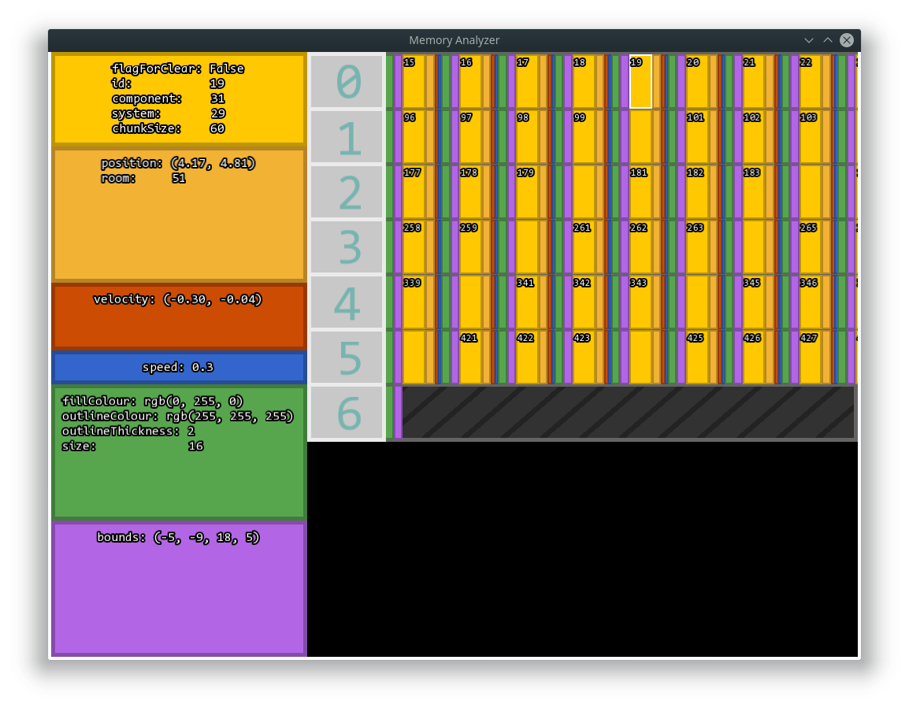

## Test-Dungeon-System

The aim of this project was to create a prototype game engine that generated random tilebased dungeons that was inhabiated by Enemies made with an explorative Entity Component System. The project has met these requirements and has since been discontinued, the code quality can vary file to file given that this was a prototype but overall is not too bad. This project also gave me a good oppurtunity to play around with debug visualisations such as the memory analyzer.

The Entity Component System is not a traditional one in this project as I had not done much research into real life ones at the time and so the code is my sort of rough interpretation of such a design. Because of this the design fails to get most of the benefits of ECS. In my system entities are variable sized and the components are stored along side them indicated with a component flag. Retrospectivley this is a terrible design as the system loses constant time entity access (Which I would of discovered if I continued) and the cache preformance benefits of a single array for each component.

## Screenshots

